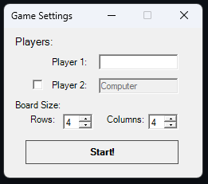
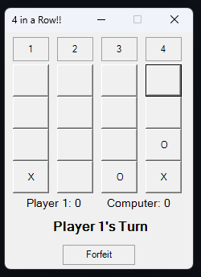

# Connect4WinForms

A classic **Connect 4** (4 in a Row) implementation built using **C\#** and **Windows Forms**. This project features a modular design, separating the core game mechanics from the graphical user interface, and includes customizable board sizes and an automated opponent.

## 🚀 Features

  * **Dynamic Board Size:** Fully customizable row and column dimensions for unique gameplay challenges.
  * **Player vs. Player:** Play locally with a friend by entering unique usernames.
  * **Player vs. Computer:** Challenge an automated opponent with a built-in turn delay for a natural feel.
  * **Score Tracking:** Real-time updates for player scores during the game session.
  * **Visual Feedback:** Interactive UI using a dynamic button grid and event-driven logic.

## 📸 Screenshots

### Game Configuration
The starting form allows players to set their names, toggle the Computer AI, and define the custom grid dimensions.



### Active Gameplay
A look at an ongoing match in a custom grid, showing dynamic column selection, piece placement, and the score/turn HUD.



## 🏗️ Project Structure

The solution is divided into two main projects to ensure a clean **Separation of Concerns**:

  * **`Connect4GameLogic`**: A Class Library containing the backend engine. It handles win-detection, player turns, score validation, and the internal board state.
  * **`Connect4WinFormsUI`**: The Windows Forms front-end. It manages the event-driven UI, including the game board creation and user interactions.

## 🛠️ Requirements

  * **Visual Studio 2019/2022**
  * **.NET Framework** or **.NET 6+**

## ⚙️ Installation & Setup

1.  **Clone the repository:**
    ```bash
    git clone https://github.com/Rotshes/Connect4-Winforms.git
    ```
2.  Open the `Connect4WinForms.sln` file in **Visual Studio**.
3.  Press **F5** to build and run the application.
